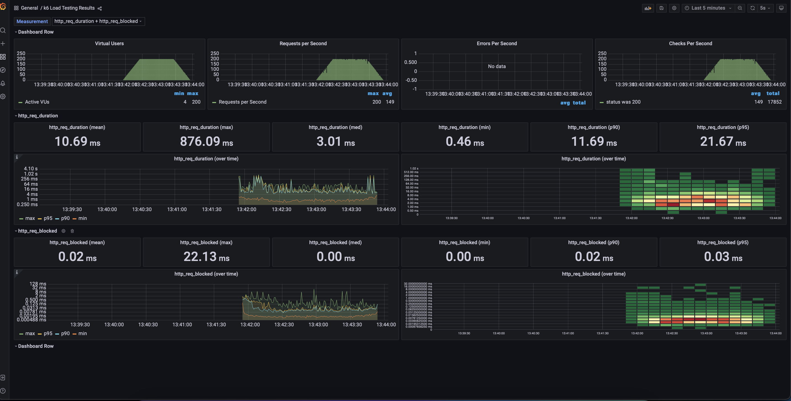

# K6 Load Test
This repository presents a beginner-friendly proof of concept for load testing in a Docker environment.

## Local Setup
Use the following `make` commands:
```
=============================
Available commands:
=============================
down                      Stop containers
load                      Run load test
up                        Setup containers
```

## Results
- Load Test Execution: Successfully executed load tests using k6, simulating high traffic scenarios to assess system performance under load;
- Automated Real-Time Reporting: Integrated Grafana with InfluxDB to provide dynamic, real-time visualization of load test results;
- Key Metrics Collected: p95 Response Time and other critical performance metrics were gathered to assess the system's efficiency, responsiveness, and stability under varying loads.


